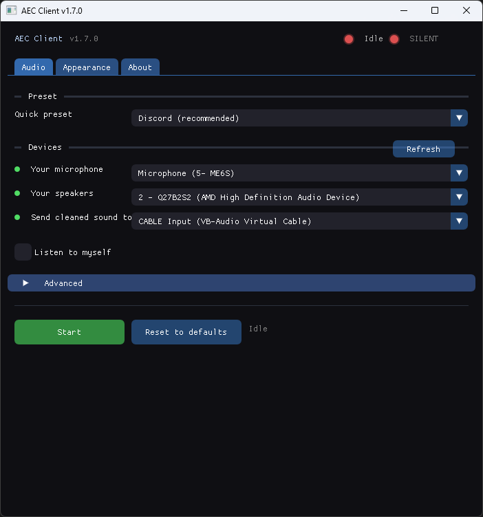

# AEC Client

> Real-time acoustic echo cancellation for Windows — use speakers and a microphone at the same time in Discord, Zoom, Teams, or any other voice app.



**Built entirely with open-source tools.** No proprietary SDKs. No cloud dependencies. No telemetry.

---

## Table of Contents

- [What It Does](#what-it-does)
- [Features](#features)
- [Quick Start](#quick-start)
- [Voice Gate](#voice-gate)
- [Engine Comparison](#engine-comparison)
- [Runtime Dependencies](#runtime-dependencies)
- [Architecture](#architecture)
- [Technical Stack](#technical-stack)
- [About the Neural Engines](#about-the-neural-engines)
- [Building from Source](#building-from-source)
- [Project Structure](#project-structure)
- [License](#license)
- [Credits](#credits)
- [Contributing](#contributing)
- [Support](#support)

---

## What It Does

AEC Client routes your microphone through one of **three acoustic echo cancellation engines**, subtracts the sound coming from your speakers, and outputs a clean, echo-free signal to a virtual audio cable. Any voice app can then use that clean signal as its microphone input.

```
Microphone ─────────────────┐
                             ├─→ AEC Engine ─→ Voice gate ─→ VB-CABLE ─→ Discord
Speakers (loopback) ────────┘                   (speech passes, silence pushed down)
```

No more headphones. No more echo. No dead-air noise.

---

## Features

- **3 selectable AEC engines** in one app:
  - **DTLN-AEC 512** — recommended default: dual-LSTM echo + noise canceller (ICASSP 2021)
  - **WebRTC AEC3** — strongest echo suppression, same engine used by Chrome and Google Meet (voice sounds processed)
  - **NKF-AEC** — lightest experimental neural Kalman filter (ICASSP 2023; can distort in real time)
- **Noise reduction** (AEC3 and NKF-AEC) — optional WebRTC noise suppression on top of echo cancellation, one checkbox
- **Low CPU usage** — under 2% on a typical desktop
- **Low latency** — 30–40 ms round-trip
- **Works with any audio device** — speakers, earphones, headsets
- **Selectable sample rate** (16 / 48 kHz)
- **Optional system tray** — runs in the background like a real utility
- **Device filtering** — virtual cables hidden from Mic/Reference dropdowns
- **Live level meters** with peak-hold
- **Presets** for common scenarios (Discord, Echo-Heavy Room, Noisy Room)
- **Clock-drift correction** — stable over long calls
- **Voice gate** — a tiny neural network pushes silence down (−12 dB), passes speech (16/48 kHz, on by default, one checkbox + one-tap mic calibration)
- **Wallpaper customization**
- **Auto-save settings** to `aec_config.txt`
- **Single-instance protection** — launching twice brings the existing window to front

---

## Quick Start

1. **Install [VB-CABLE](https://vb-audio.com/Cable/)** (free virtual audio cable). Reboot.
2. **Download** the latest release from [Releases](https://github.com/samudinzul/aec-client/releases/latest) and extract it anywhere.
3. **Run `aec_gui.exe`**.
4. **Select your devices** (first run shows a 3-step checklist):
   - **Your microphone** → your physical mic
   - **Your speakers** → your physical speakers
   - **Send cleaned sound to** → `CABLE Input (VB-Audio Virtual Cable)` (picked automatically)
5. **Pick an engine** under Advanced — DTLN-AEC is the default; AEC3 is the strongest echo pick; NKF-AEC is the lightest (experimental). Optionally tick **Noise reduction** on AEC3 or NKF-AEC for WebRTC noise suppression.
6. **Click Start**. Keep speakers at a moderate volume — very loud
   speakers make any canceller mistake your voice for echo (AEC3 will
   cut you mid-sentence in double-talk). If the room must be loud,
   use DTLN-AEC instead.
7. **In Discord** → Voice & Video settings:
   - **Input Device**: `CABLE Output (VB-Audio Virtual Cable)`
- **Input Profile**: **Voice Isolation** — one tap that turns on
      Discord's noise cleanup. Echo is already removed by this app
      (DTLN and the optional **Noise reduction** checkbox also remove
      noise; bare AEC3/NKF-AEC are echo-only — which is exactly why
      Discord's cleanup stays useful).
   - Prefer manual control? Pick the **Custom** profile instead:
     Echo Cancellation **OFF** (this app does it — two cancellers
     stacked fight each other), Noise Suppression **Krisp**
     (**Standard** on weak PCs), Automatic Gain Control **OFF**.

Done. Talk normally with speakers on.

> **SmartScreen on first launch?** The app is unsigned (no paid
> code-signing certificate), so Windows may show **"Windows protected
> your PC"**. This is expected: click **More info → Run anyway**.
> Every release is built straight from the public source in this repo
> — audit it, rebuild it, or scan the ZIP on VirusTotal if unsure.

---

## Voice Gate

After echo cancellation, a tiny neural network checks for speech many times a second. Speech passes to Discord; silence is pushed down (−12 dB, not muted — so the level never pumps). No setup, no recording — it's on by default.

- Green **SPEAKING** pill at the top = speech going out. Grey **SILENT** = pushed down.
- It hears *any* speech, not just yours — it sits after the echo canceller, so what's left is overwhelmingly your voice.
- Uncheck **Voice gate** in the Audio tab to pass original audio through.
- **Calibrate for my mic** (under Voice gate, idle or running): starts audio if needed (you'll hear yourself, live meters, no CABLE needed), you speak normally 5 s, then back to idle — press Start to use it. Sets the speech/silence lines for your mic + engine combo. Re-calibrate after switching mic or engine; Reset restores defaults.
- Works at **16 and 48 kHz** (the detector itself is 16 kHz fixed; at 48 kHz an internal downsample feeds only the detector, your audio stays full-rate) — NKF and DTLN run at 16000 (locked); AEC3 offers 16000 or 48000.

---

## Engine Comparison

| Engine | Voice preservation | Echo removal | CPU | Sample Rate | Latency | Best For |
|--------|---------------|-------------|-----|-------------|---------|----------|
| **DTLN-AEC 512** | ⭐⭐⭐⭐ | ⭐⭐⭐⭐⭐ | Moderate–High | 16 kHz only | ~32 ms | Recommended default — cleanest output, removes noise too |
| **WebRTC AEC3** | ⭐⭐⭐ | ⭐⭐⭐⭐⭐ | Moderate | 16/48 kHz | ~40 ms | Strongest echo removal |
| **NKF-AEC** | ⭐⭐⭐⭐⭐ | ⭐⭐⭐⭐ | Low | 16 kHz only | ~32 ms | Lightest CPU — experimental, can distort |

*Voice preservation = your voice survives intact, double-talk included (both sides speaking at once is the hardest case and governs the score). Echo removal = the far-end echo actually gone. DTLN additionally removes background noise (see its Best-For); AEC3 and NKF-AEC can add WebRTC noise suppression via the **Noise reduction** checkbox. NKF-over-DTLN on preservation and DTLN-over-NKF on suppression are research-backed: on the ICASSP 2021 blind-test double-talk set NKF scores AECMOS-Other 4.02 vs DTLN 3.73 (near-end quality) while DTLN scores AECMOS-Echo 4.31 vs NKF 4.02 (echo gone), and NKF takes the best synthetic double-talk PESQ at 2.77 (Jiang et al., ICASSP 2023) — your ears outrank this table. Sep 2026 spike note: a post-AEC3 neural mask (Microsoft DEC baseline) was tried and nuked for muting echo-free speech down to 0.07% — the AEC3 suppression muscle is bare AEC3, and stays. AEC3 trades naturalness for suppression muscle — its suppressor leaves voices sounding processed/cleaned; NKF can be the most natural but drifts when real-time loopback delay misaligns its linear filter (hence the Sep 2026 demotion from default). Loud-speaker caveat: AEC3's echo removal assumes sane levels — its suppressor works on echo-to-voice ratio per band, so speakers much louder than your mic read as "all echo" and your voice gets clamped in double-talk (no identity concept; Meta measured a 39% double-talk gap vs their Beryl canceller). Gain-structure first (speakers down, mic up/closer), DTLN second — it cuts echo without the AEC3 clamp.*

**In short:** start on **DTLN** (the default) — cleanest output and it removes noise too. Switch to **AEC3** when echo is winning (loud speakers, echoey room) — strongest removal — with the **Noise reduction** checkbox if you want WebRTC noise suppression on top. **NKF** stays for the lightest CPU if it sounds clean on your rig (linear research engine — can distort when loopback delay drifts).

---

## Runtime Dependencies

The release ZIP bundles all required DLLs:

| File | Size | Purpose |
|------|------|---------|
| `aec_gui.exe` | ~2.4 MB | Main application |
| `libnkf_aec.dll` | ~1.3 MB | NKF neural engine |
| `libwebrtc-audio-processing-1-3.dll` | ~950 KB | WebRTC AEC3 + noise suppression |
| `onnxruntime.dll` | ~28 MB | Neural inference (NKF, DTLN ONNX fallback, Silero VAD) |
| `libwinpthread-1.dll` | ~63 KB | MinGW thread runtime |
| `libgcc_s_seh-1.dll` | ~150 KB | GCC runtime |
| `libstdc++-6.dll` | ~2.6 MB | C++ standard library |
| `models/nkf.onnx` | ~45 KB | NKF model |
| `models/dtln_aec_512_*` | user-supplied | DTLN models (optional) |
| `tensorflowlite_c.dll` | user-supplied | TFLite runtime for DTLN (optional) |

**External dependency (user-installed):** [VB-CABLE](https://vb-audio.com/Cable/)

---

## Architecture

```
┌─────────────────────────────────────────────────────────────────┐
│  Microphone (WASAPI capture)                                    │
│         ↓                                                       │
│  Lock-free ring buffer  ──┐                                     │
│                            ├──→ AEC Engine ──→ Clean signal    │
│  Speaker loopback (WASAPI) │                                     │
│         ↓                  │                                     │
│  Lock-free ring buffer  ──┘                                     │
│         ↓                                                       │
│  Output → VB-CABLE → Discord                                    │
└─────────────────────────────────────────────────────────────────┘
```

**Design principles:**

- **No locks in audio thread** — SPSC ring buffers use atomic head/tail indices
- **No heap allocation in audio callback** — stack buffers only
- **Sub-10 ms gate decisions** — 512-sample VAD inference inline (< 1 ms), no worker thread
- **Drift correction** — skips/duplicates samples if mic/speaker clocks diverge
- **Engine abstraction** — runtime swap between 3 engines with a single enum + function pointer
- **Settings persistence** — plain text `aec_config.txt`
- **Single-instance mutex** — prevents accidental double launches

---

## Technical Stack

### Languages

| Language | Role |
|----------|------|
| **C++17** | Main application |
| **C** | Third-party libraries (miniaudio, stb_image, GGML via NKF) |
| **CMake** | Build system |
| **Bash** | Build scripts |
| **Markdown** | Documentation |

### Build Toolchain

| Tool | Version | Purpose |
|------|---------|---------|
| **GCC (MinGW-w64)** | 16.2.0 | C/C++ compiler |
| **CMake** | 3.20+ | Build system generator |
| **Ninja** | — | Fast build backend |
| **ccache** | — | Compile caching |
| **gendef / dlltool** | — | Generate MinGW import libraries |
| **MSYS2 UCRT64** | — | Build environment |

### AEC Engines

| Engine | Type | Language | Source |
|--------|------|----------|--------|
| **WebRTC AEC3** | Advanced DSP | C++ | [MSYS2 package](https://packages.msys2.org/package/mingw-w64-ucrt-x86_64-webrtc-audio-processing-1) |
| **NKF-AEC** | Neural (Kalman) | C++ | [William1617/REAL_TIME_NKF_AEC](https://github.com/William1617/REAL_TIME_NKF_AEC) |
| **DTLN-AEC** | Neural (dual-LSTM) | C++ | [breizhn/DTLN-aec](https://github.com/breizhn/DTLN-aec) |

### Libraries

| Library | Language | Purpose |
|---------|----------|---------|
| **[miniaudio](https://github.com/mackron/miniaudio)** | C (single-header) | Cross-platform audio I/O |
| **[Dear ImGui](https://github.com/ocornut/imgui)** | C++ | Immediate-mode GUI |
| **[GLFW](https://www.glfw.org/)** | C | Window + OpenGL context |
| **[OpenGL](https://www.opengl.org/)** | — | Rendering backend |
| **[stb_image](https://github.com/nothings/stb)** | C (single-header) | Image loading for wallpapers |
| **[ONNX Runtime](https://onnxruntime.ai/)** | C++ | Neural inference (NKF-AEC, DTLN-AEC ONNX fallback, Silero VAD) |
| **[pocketfft](https://github.com/mreineck/pocketfft)** | C++ (header) | FFT for NKF-AEC and DTLN-AEC |
| **[AudioFile](https://github.com/adamstark/AudioFile)** | C++ (header) | WAV I/O for NKF-AEC |

### Windows APIs

| API | Purpose |
|-----|---------|
| **WASAPI** (via miniaudio) | Audio capture, loopback, playback |
| **Win32** (`windows.h`) | Native window handle manipulation |
| **Shell** (`shellapi.h`) | System tray icon |
| **COM** (`ole32`, `uuid`) | Underneath WASAPI |
| **WinMM** (`winmm`) | Legacy audio support |
| **shell32** | Tray icon functions |

### DSP Concepts

- Acoustic echo cancellation via adaptive subband filtering (AEC3)
- Neural Kalman filtering (NKF-AEC)
- Dual-signal LSTM echo + noise cancellation (DTLN-AEC)
- Optional WebRTC noise suppression (AEC3, NKF-AEC)
- Frame buffering at 10–16 ms intervals
- Lock-free SPSC ring buffers (audio thread ↔ UI thread)
- Clock-drift correction (dynamic sample drop/duplicate)
- RMS metering with peak hold + decay

---

## About the Neural Engines

### NKF-AEC

NKF-AEC (Neural Kalman Filtering for Acoustic Echo Cancellation) is a research model published at **ICASSP 2023** by Jiang et al. It combines classical Kalman filtering with a small neural network.

- **Model size**: 45 KB (5.3K parameters)
- **Sample rate**: 16 kHz (auto-locked)
- **Latency**: ~32 ms
- **CPU**: Very low
- **Requires**: ONNX Runtime (28 MB DLL)

The wrapper at `src/nkf_wrapper.cpp` handles real-time streaming via the `ProcessBlock()` extension we added.

The full source is patched in `third_party/REAL_TIME_NKF_AEC/` and builds to `libnkf_aec.dll` (1.3 MB).

### DTLN-AEC 512

DTLN-AEC (Dual-signal Transformation LSTM Network) by Westhausen & Meyer (**ICASSP 2021**, 3rd place in the Microsoft AEC Challenge) cancels echo **and** noise with a two-stage LSTM (separation mask + waveform refinement).

- **Model size**: 10.4M parameters (512 LSTM units/layer), two files: `dtln_aec_512_1` + `dtln_aec_512_2`
- **Sample rate**: 16 kHz (auto-locked)
- **DSP**: 512-sample block, 128-sample shift, 257-bin FFT, overlap-add
- **Runtime (in probe order)**:
  1. **TFLite** — drop `dtln_aec_512_1.tflite` + `dtln_aec_512_2.tflite` from [breizhn/DTLN-aec](https://github.com/breizhn/DTLN-aec) into `models/` plus a Windows `tensorflowlite_c.dll` next to `aec_gui.exe` (loaded at runtime, no rebuild needed)
  2. **ONNX fallback** — `dtln_aec_512_1.onnx` + `dtln_aec_512_2.onnx` in `models/` (reuses the already-linked ONNX Runtime)
- Without either pair the engine reports `Failed to load DTLN model` on Start; all other engines are unaffected.

The wrapper at `src/dtln_wrapper.cpp` handles frame accumulation (128-sample shifts bridged to the 160-sample audio callback), int16 ↔ float conversion, LSTM state carry-over, and graceful fallback to mic on inference failure.

---

## Building from Source

### Prerequisites

Install [MSYS2](https://www.msys2.org/) and open the **UCRT64** terminal. Then:

```bash
pacman -S mingw-w64-ucrt-x86_64-gcc
pacman -S mingw-w64-ucrt-x86_64-cmake
pacman -S mingw-w64-ucrt-x86_64-ninja
pacman -S mingw-w64-ucrt-x86_64-ccache
pacman -S mingw-w64-ucrt-x86_64-glfw
pacman -S mingw-w64-ucrt-x86_64-webrtc-audio-processing-1
pacman -S mingw-w64-ucrt-x86_64-onnxruntime
pacman -S git zip
```

### Clone

```bash
git clone https://github.com/samudinzul/aec-client.git
cd aec-client
```

### Build NKF-AEC Engine

```bash
cd third_party/REAL_TIME_NKF_AEC/c
cmake -B build -G "MinGW Makefiles" -DCMAKE_MAKE_PROGRAM=/ucrt64/bin/mingw32-make.exe
cmake --build build
cd ../../..
```

Produces `libnkf_aec.dll`.

### Download Models

```bash
mkdir -p models

# NKF-AEC model is bundled in third_party/REAL_TIME_NKF_AEC/python/nkf.onnx
cp third_party/REAL_TIME_NKF_AEC/python/nkf.onnx models/

# DTLN-AEC 512 (optional — engine stays disabled until these exist)
# Option A (preferred, upstream weights verbatim):
#   download dtln_aec_512_1.tflite + dtln_aec_512_2.tflite from
#   https://github.com/breizhn/DTLN-aec/tree/main/pretrained_models
#   into models/, plus a Windows tensorflowlite_c.dll next to aec_gui.exe
# Option B (no new DLL): convert the pair to
#   models/dtln_aec_512_1.onnx + models/dtln_aec_512_2.onnx

# Silero VAD voice gate (optional — gate reports "model not found" until
# vendored, ~2.2 MB, MIT, sha256 1a153a22… = upstream v6.2.1)
curl -L -o models/silero_vad.onnx \
  "https://github.com/snakers4/silero-vad/raw/master/src/silero_vad/data/silero_vad.onnx"
```

### Build the Main App

```bash
cd /path/to/aec-client
cmake -B build -G Ninja \
    -DCMAKE_MAKE_PROGRAM=/ucrt64/bin/ninja.exe \
    -DCMAKE_C_COMPILER_LAUNCHER=ccache \
    -DCMAKE_CXX_COMPILER_LAUNCHER=ccache
cmake --build build
```

First build: ~1 minute. Subsequent builds with ccache: ~15 seconds.

Output: `build/aec_gui.exe`.

### Run

```bash
cd build
./aec_gui.exe
```

---

## Project Structure

```
aec-client/
├── src/
│   ├── main.cpp                    Entry point, GUI, audio pipeline
│   ├── aec3_wrapper.cpp/.h         WebRTC AEC3 C wrapper
│   ├── nkf_wrapper.cpp/.h          NKF-AEC C wrapper
│   ├── dtln_wrapper.cpp/.h         DTLN-AEC C wrapper (TFLite/ONNX)
│   └── silero_wrapper.cpp/.h       Silero VAD C wrapper (voice gate)
│
├── include/
│   ├── miniaudio.h                 Audio I/O
│   └── stb_image.h                 Image loading
│
├── libs/
│   └── tensorflowlite_c.dll        TFLite runtime for DTLN (optional, user-supplied)
│
├── third_party/
│   ├── imgui/                      Dear ImGui source
│   └── REAL_TIME_NKF_AEC/          NKF neural engine (patched)
│       ├── c/                      C++ source
│       └── python/                 Original model + scripts
│
├── models/
│   ├── nkf.onnx                    NKF model (45 KB)
│   ├── dtln_aec_512_{1,2}.tflite|.onnx  DTLN models (user-supplied, optional)
│   └── silero_vad.onnx             Silero VAD model (2.2 MB, user-supplied, optional)
│
├── screenshots/
│   └── main.png                    README image
│
├── wallpapers/                     User-supplied backgrounds
│
├── release/                        Distribution builds (gitignored)
│
├── CMakeLists.txt                  Build configuration
├── scripts/
│   ├── make-release.sh             Release bundle + zip builder
│   └── README.txt                  End-user doc template (%%VERSION%%)
├── README.md                       This file
├── LICENSE                         MIT
├── CHANGELOG.md                    Version history
└── .gitignore
```

---

## License

MIT License — see [LICENSE](LICENSE).

Third-party credits in [LICENSES/THIRD-PARTY.txt](LICENSES/THIRD-PARTY.txt).

---

## Credits

- **WebRTC Audio Processing** — Google (BSD-3)
- **NKF-AEC** — Jiang et al., ICASSP 2023 (MIT)
- **DTLN-AEC** — Westhausen & Meyer, ICASSP 2021 (MIT)
- **Silero VAD** — Silero Team (MIT)
- **ONNX Runtime** — Microsoft (MIT)
- **Dear ImGui** — Omar Cornut (MIT)
- **miniaudio** — David Reid (MIT-0)
- **GLFW** — Marcus Geelnard & Camilla Löwy (zlib)
- **stb_image** — Sean Barrett (Public Domain)
- **pocketfft** — Max-Planck-Society (BSD-3)
- **AudioFile** — Adam Stark (MIT)
- **VB-CABLE** — VB-Audio (free for personal use)

---

## Contributing

Pull requests welcome. For major changes, please open an issue first.

## Support

- Report bugs: [Issues](https://github.com/samudinzul/aec-client/issues)
- Discussions: [Discussions](https://github.com/samudinzul/aec-client/discussions)
