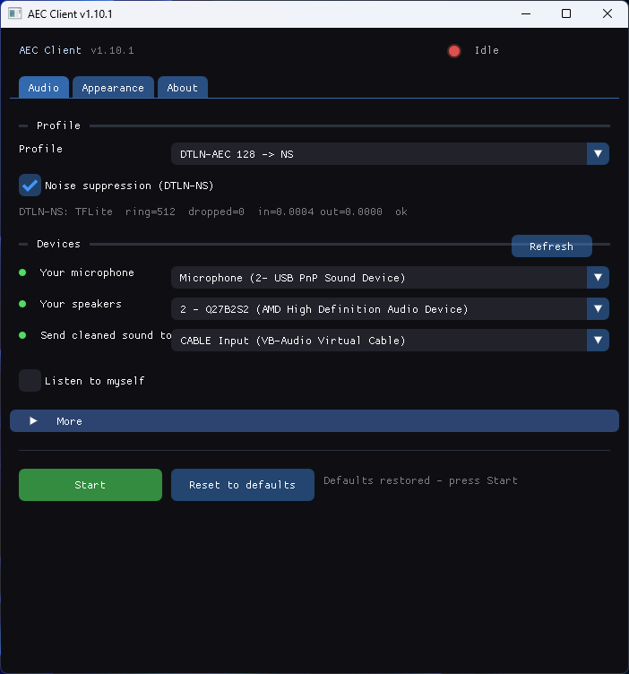

# AEC Client

> Real-time acoustic echo cancellation for Windows — use speakers and a microphone at the same time in Discord, Zoom, Teams, or any other voice app.



**Built entirely with open-source tools.** No proprietary SDKs. No cloud dependencies. No telemetry.

---

## Table of Contents

- [What It Does](#what-it-does)
- [Features](#features)
- [Quick Start](#quick-start)
- [Profiles](#profiles)
- [Profile Comparison](#profile-comparison)
- [Runtime Dependencies](#runtime-dependencies)
- [Architecture](#architecture)
- [Technical Stack](#technical-stack)
- [About the Neural Engines](#about-the-neural-engines)
- [Building from Source](#building-from-source)
- [Project Structure](#project-structure)
- [License](#license)
- [Credits](#credits)
- [Contributing](#contributing)
- [Support](#support)

---

## What It Does

AEC Client routes your microphone through a **processing profile** (an echo canceller stacked with a dereverb and feedback-suppression post chain), subtracts the sound coming from your speakers, and outputs a clean, echo-free signal to a virtual audio cable. Any voice app can then use that clean signal as its microphone input.

```
Microphone ─────────────────┐
                             ├─→ Engine ─→ WPE ─→ Notch ─→ VB-CABLE ─→ Discord
Speakers (loopback) ────────┘     (AEC3 / NKF / DTLN)  (post stages, ON/OFF ticks)
```

No more headphones. No more echo. No dead-air noise.

---

## Features

- **3 engine profiles** — one menu shows the engine and its chain (the engine is not configurable on its own):
  - **DTLN-AEC 128** — dual-LSTM echo + noise canceller (ICASSP 2021; 128 LSTM units for lower CPU). The default; DTLN removes noise itself.
  - **WebRTC AEC3** — the same canceller Chrome and Google Meet use: strongest canceller, with the post chain stacked on top.
  - **NKF-AEC** — tiny neural Kalman core (ICASSP 2023, 45 KB model), for weak CPUs.
- **What you see is what runs** — the profile label always reads `engine` or `engine → WPE → Notch`, matching the two post-stage ticks, and the status line reports the running chain, e.g. `Running (16000 Hz, AEC3 + WPE + Notch)`.
- **Dereverb (WPE)** — streaming weighted-prediction-error dereverbberation: eats late room echo and reverb tails after the canceller; one always-visible **Dereverb (WPE)** tick, ~32 ms delay, model-free (no ONNX), 16/48 kHz.
- **Feedback suppression (notch)** — two adaptive LMS notch filters that track narrowband howling/ringing tones (speaker-mic loops); exact bypass until a tone is actually captured, so voice passes bit-exact while idle.
- **Voice never cut** — a soft limiter replaces hard clipping, and every fail path fades instead of muting; NKF keeps its divergence guard, staged exposure and self-monitor loop detector.
- **Low CPU usage** — engines typically well under 2% per stream on a typical desktop; the post stages add a fraction of a percent.
- **Low latency** — 30–40 ms round-trip (+32 ms when WPE is stacked)
- **Works with any audio device** — speakers, earphones, headsets
- **Selectable sample rate** (16 / 48 kHz)
- **Optional system tray** — runs in the background like a real utility
- **Device filtering** — virtual cables hidden from Mic/Reference dropdowns
- **Live level meters** with peak-hold (meters show the post-stage signal, i.e. what Discord hears)
- **Clock-drift correction** — stable over long calls
- **Wallpaper customization**
- **Auto-save settings** to `aec_config.txt`
- **Single-instance protection** — launching twice brings the existing window to front

---

## Quick Start

1. **Install [VB-CABLE](https://vb-audio.com/Cable/)** (free virtual audio cable). Reboot.
2. **Download** the latest release from [Releases](https://github.com/samudinzul/aec-client/releases/latest) and extract it anywhere.
3. **Run `aec_gui.exe`**.
4. **Select your devices** (first run shows a 3-step checklist):
   - **Your microphone** → your physical mic
   - **Your speakers** → your physical speakers
   - **Send cleaned sound to** → `CABLE Input (VB-Audio Virtual Cable)` (picked automatically)
5. **Pick an engine** at the top of the Audio tab — the label shows the engine and its chain (e.g. `WebRTC AEC3 → WPE → Notch`). Start with the default **DTLN-AEC 128**; try **WebRTC AEC3** if echo still gets through, or **NKF-AEC** on a busy PC. The **Dereverb (WPE)** / **Feedback suppression (notch)** ticks and the sample rate under Advanced can be changed any time without losing the selection.
6. **Click Start**. Keep speakers at a moderate volume. Very loud speakers make any canceller leave echo behind (and can push AEC3 into cutting mid-sentence) — if the room must be loud, stay on DTLN-AEC 128.
7. **In Discord** → Voice & Video settings:
   - **Input Device**: `CABLE Output (VB-Audio Virtual Cable)`
   - **Input Profile**: **Voice Isolation** — one tap that turns on
      Discord's noise cleanup. Echo and hiss are already removed by
      this app (DTLN removes noise itself; all engines stack the
      WPE + notch post stages).
   - Prefer manual control? Pick the **Custom** profile instead:
     Echo Cancellation **OFF** (this app does it — two cancellers
     stacked fight each other), Noise Suppression **Krisp**
     (**Standard** on weak PCs), Automatic Gain Control **OFF**.

Done. Talk normally with speakers on.

> **SmartScreen on first launch?** The app is unsigned (no paid
> code-signing certificate), so Windows may show **"Windows protected
> your PC"**. This is expected: click **More info → Run anyway**.
> Every release is built straight from the public source in this repo
> — audit it, rebuild it, or scan the ZIP on VirusTotal if unsure.

---

## Profiles

One combo at the top of the Audio tab selects the engine. The label shows the engine name directly — plus `→ WPE` / `→ Notch` while the post stages are ticked — so the menu always tells you exactly what runs. The engine never changes any other way.

| Label | Chain | Rate | Post stages | What it is for |
|-------|-------|------|-------------|----------------|
| **DTLN-AEC 128** *(default)* | DTLN-128 → WPE → Notch | 16 kHz | on/on | Best echo + reverb handling; DTLN removes noise itself. |
| **WebRTC AEC3** | WebRTC AEC3 → WPE → Notch | 16 kHz (48 kHz optional) | on/on | Reliable, well-tested baseline: strongest canceller + full cleanup chain. |
| **NKF-AEC** | NKF → WPE → Notch | 16 kHz | on/on | Weak CPUs: cheap canceller, same post chain. |

- The **Dereverb (WPE)** and **Feedback suppression (notch)** ticks are free knobs: on, the label (and the chain) gain `→ WPE` / `→ Notch`; they persist across restarts, can be toggled mid-call, and **a profile switch never resets them** (both default ON for every engine).
- Sample rate (Advanced → Processing), gains and devices are independent of the profile. Only the 16-kHz-only engines (DTLN, NKF) force the rate back to 16 kHz.
- Status line shows the active chain, e.g. `Running (16000 Hz, AEC3 + WPE + Notch)`.
- Old configs migrate automatically: the five v1.9 presets map onto these three, and an old *Manual* setup lands on the profile for its engine.

---

## Profile Comparison

| Profile | Your voice | Echo removed | CPU | When to use it |
|--------|------------|--------------|-----|----------------|
| **DTLN-AEC 128** *(default)* | Sounds natural | Very good | Moderate | **Start here.** Cleanest overall; also removes background noise. |
| **WebRTC AEC3** | Can sound a bit processed | Strongest | Moderate | Echo still getting through (loud speakers, echoey room). |
| **NKF-AEC** | Usually natural | Good (linear-only) | Small | Busy PC; or natural voice with a light cleanup chain. |

**Voice** = how natural you sound when both sides talk at once. **Echo** = how much of the other person’s speaker sound is cancelled out.

**Quick pick:**
1. Stay on **DTLN-AEC 128** unless something is wrong.
2. Still hearing echo? Try **WebRTC AEC3** (voice may sound cleaned up).
3. Busy PC? Try **NKF-AEC**. Can glitch if speaker delay drifts.

Keep speaker volume moderate — very loud speakers make any engine treat your voice as echo.

---

## Runtime Dependencies

The release ZIP bundles all required DLLs:

| File | Size | Purpose |
|------|------|---------|
| `aec_gui.exe` | ~2.4 MB | Main application (includes the NKF neural engine) |
| `libwebrtc-audio-processing-1-3.dll` | ~950 KB | WebRTC AEC3 + high-pass filter |
| `onnxruntime.dll` | ~4.9 MB | Neural inference (NKF, DTLN ONNX fallback; official MS build, UPX-compressed) |
| `msvcp140/vcruntime140*.dll` | ~900 KB | VC++ 14 runtime (required by onnxruntime.dll) |
| `tensorflowlite_c.dll` | ~4.5 MB | TFLite runtime for DTLN (primary path) |
| `libwinpthread-1.dll` | ~63 KB | MinGW thread runtime |
| `libgcc_s_seh-1.dll` | ~150 KB | GCC runtime |
| `libstdc++-6.dll` | ~2.6 MB | C++ standard library |
| `models/nkf.onnx` | ~45 KB | NKF model |
| `models/dtln_aec_128_{1,2}.tflite` | ~7 MB | DTLN-AEC 128 pair (default profile) |

**External dependency (user-installed):** [VB-CABLE](https://vb-audio.com/Cable/)

---

## Architecture

How audio flows through the app:

```
Your microphone  ─────────┐
                           ├─→  Engine  ─→  WPE  ─→  Notch  ─→  VB-CABLE  ─→  Discord / Zoom
Your speakers  ───────────┘   (AEC3 / NKF /   (dereverb,   (feedback
(loopback = what you hear)     DTLN)           ~32 ms)      suppression)
```

1. **Capture** — the mic and the speaker output (loopback) are read at the same time.
2. **Cancel** — the engine subtracts the speaker sound from the mic, leaving your voice.
3. **Post stages** — the cleaned audio passes the WPE dereverb and the adaptive notch (each with its own tick; meters show this stage — what Discord hears).
4. **Deliver** — the signal runs through the soft limiter and output gain, goes to VB-CABLE; Discord uses that as its microphone.

Settings are saved automatically. Only one copy of the app runs at a time (opening it again focuses the existing window).

---

## Technical Stack

### Languages

| Language | Role |
|----------|------|
| **C++17** | Main application |
| **C** | Third-party libraries (miniaudio, stb_image, GGML via NKF) |
| **CMake** | Build system |
| **Bash** | Build scripts |
| **Markdown** | Documentation |

### Build Toolchain

| Tool | Version | Purpose |
|------|---------|---------|
| **GCC (MinGW-w64)** | 16.2.0 | C/C++ compiler |
| **CMake** | 3.20+ | Build system generator |
| **Ninja** | — | Fast build backend |
| **ccache** | — | Compile caching |
| **gendef / dlltool** | — | Generate MinGW import libraries |
| **MSYS2 UCRT64** | — | Build environment |

### AEC Engines

| Engine | Type | Language | Source |
|--------|------|----------|--------|
| **WebRTC AEC3** | Advanced DSP | C++ | [MSYS2 package](https://packages.msys2.org/package/mingw-w64-ucrt-x86_64-webrtc-audio-processing-1) |
| **NKF-AEC** | Neural (Kalman) | C++ | [William1617/REAL_TIME_NKF_AEC](https://github.com/William1617/REAL_TIME_NKF_AEC) |
| **DTLN-AEC** | Neural (dual-LSTM) | C++ | [breizhn/DTLN-aec](https://github.com/breizhn/DTLN-aec) |
| **WPE dereverb** | Model-free DSP | C++ (in-tree) | `src/wpe.cpp` |
| **Adaptive notch** | Model-free DSP | C++ (in-tree) | `src/notch.cpp` |

### Libraries

| Library | Language | Purpose |
|---------|----------|---------|
| **[miniaudio](https://github.com/mackron/miniaudio)** | C (single-header) | Cross-platform audio I/O |
| **[Dear ImGui](https://github.com/ocornut/imgui)** | C++ | Immediate-mode GUI |
| **[GLFW](https://www.glfw.org/)** | C | Window + OpenGL context |
| **[OpenGL](https://www.opengl.org/)** | — | Rendering backend |
| **[stb_image](https://github.com/nothings/stb)** | C (single-header) | Image loading for wallpapers |
| **[ONNX Runtime](https://onnxruntime.ai/)** | C++ | Neural inference (NKF-AEC, DTLN-AEC ONNX fallback) |
| **[pocketfft](https://github.com/mreineck/pocketfft)** | C++ (header) | FFT for NKF-AEC, DTLN-AEC, WPE |
| **[AudioFile](https://github.com/adamstark/AudioFile)** | C++ (header) | WAV I/O for NKF-AEC |

### Windows APIs

| API | Purpose |
|-----|---------|
| **WASAPI** (via miniaudio) | Audio capture, loopback, playback |
| **Win32** (`windows.h`) | Native window handle manipulation |
| **Shell** (`shellapi.h`) | System tray icon |
| **COM** (`ole32`, `uuid`) | Underneath WASAPI |
| **WinMM** (`winmm`) | Legacy audio support |
| **shell32** | Tray icon functions |

### DSP Concepts

- Acoustic echo cancellation via adaptive subband filtering (AEC3)
- Neural Kalman filtering (NKF-AEC) with delay alignment (TDC)
- Dual-signal LSTM echo + noise cancellation (DTLN-AEC)
- WPE dereverberation (32 ms STFT frames, per-bin recursive weighted least squares, speech-gated predictor bound)
- Adaptive LMS notch tracking (two cascaded second-order notches, slew-limited frequency, engage-gating bypass)
- Soft limiter (−3 dBFS tanh knee) + fail-open fade (never a click)
- Frame buffering at 10–16 ms intervals
- Lock-free SPSC ring buffers (audio thread ↔ UI thread)
- Clock-drift correction (dynamic sample drop/duplicate)
- RMS metering with peak hold + decay
- Self-monitor loop detection (NKF: hold safe exposure while Listen-to-myself rings)

---

## About the Neural Engines

### NKF-AEC

NKF-AEC (Neural Kalman Filtering for Acoustic Echo Cancellation) is a research model published at **ICASSP 2023** by Jiang et al. It combines classical Kalman filtering with a small neural network.

- **Model size**: 45 KB (~5.3K parameters — tiny *neural* core)
- **Sample rate**: 16 kHz (auto-locked)
- **Latency**: ~32 ms
- **CPU**: Small for the NKF core alone (paper RTF 0.09). **Not** measured against AEC3 in this app. NKF is strictly linear since 1.9 (the residual AEC3 pass was retired) — the v2.0 **NKF-AEC** profile is NKF + the WPE/notch post chain stacked.
- **Requires**: ONNX Runtime (5 MB DLL) — no other model files

Production path adds: **time-delay compensation** (cross-correlation vs loopback), staged exposure (no cold-start spikes), a **divergence guard**, and a **self-monitor loop detector** (Listen-to-myself / Discord mic test). The v1.9 WebRTC NS post-stage was retired in 2.0; the in-tree WPE dereverb returns as a global post stage alongside the new adaptive notch.

The wrapper at `src/nkf_wrapper.cpp` handles real-time streaming via the `ProcessBlock()` extension we added.

The full source is patched in `third_party/REAL_TIME_NKF_AEC/` and compiled directly into `aec_gui.exe` (a standalone `libnkf_aec.dll` went stale against the header once — no separate DLL build anymore).

### Post stages (WPE + adaptive notch)

Both stages run after every engine, both are always-visible ticks with independent defaults (ON for all profiles; a profile switch never resets them), and both scale with the sample rate (16/48 kHz).

- **Dereverb (WPE)** — streaming single-channel Weighted Prediction Error dereverberation: 32 ms STFT frames (512 / 1536 samples), regressors from the observed history (delay 2, 5 taps), per-bin recursive weighted least squares with a forget factor, ~32 ms algorithmic latency. While you talk the predictor bound tightens (speech flag) so voice level survives; between speech it opens up to eat reverb tails. Model-free: pure pocketfft, no ONNX file. `src/wpe.cpp`.
- **Feedback suppression (notch)** — two cascaded second-order notch filters (~60 Hz bandwidth) whose center frequencies track narrowband howling/ringing via LMS on the analytic (quadrature) component. Slew-limited frequency moves (8000 Hz/s), adaptation frozen while you talk (voice harmonics must never capture the notch), silence floor parks it, and a section stays an exact bypass until it actually removes >45% of its input energy for ~200 ms (engage-gating) — idle voice passes bit-exact. `src/notch.cpp`.
- **Fail-open**: both stages bound their own state (clamped frequencies, capped predictor output, pass-through latch on internal errors) — a stage can never mute or blow up the stream.

### DTLN-AEC 128

DTLN-AEC (Dual-signal Transformation LSTM Network) by Westhausen & Meyer (**ICASSP 2021**, 3rd place in the Microsoft AEC Challenge) cancels echo **and** noise with a two-stage LSTM (separation mask + waveform refinement).

- **Model size**: 1.8M parameters (128 LSTM units/layer), two files: `dtln_aec_128_1` + `dtln_aec_128_2` (lighter/faster than the upstream 512-unit pair; same 512-sample DSP block)
- **Sample rate**: 16 kHz (auto-locked)
- **DSP**: 512-sample block, 128-sample shift, 257-bin FFT, overlap-add
- **Runtime (in probe order)**:
  1. **TFLite** — drop `dtln_aec_128_1.tflite` + `dtln_aec_128_2.tflite` from [breizhn/DTLN-aec](https://github.com/breizhn/DTLN-aec) into `models/` plus a Windows `tensorflowlite_c.dll` next to `aec_gui.exe` (loaded at runtime, no rebuild needed)
  2. **ONNX fallback** — `dtln_aec_128_1.onnx` + `dtln_aec_128_2.onnx` in `models/` (reuses the already-linked ONNX Runtime)
- Without either pair the engine reports `Failed to load DTLN model` on Start; all other engines are unaffected.

The wrapper at `src/dtln_wrapper.cpp` handles frame accumulation (128-sample shifts bridged to the 160-sample audio callback), int16 ↔ float conversion, LSTM state carry-over, and graceful fallback to mic on inference failure.

---

## Building from Source

### Prerequisites

Install [MSYS2](https://www.msys2.org/) and open the **UCRT64** terminal. Then:

```bash
pacman -S mingw-w64-ucrt-x86_64-gcc
pacman -S mingw-w64-ucrt-x86_64-cmake
pacman -S mingw-w64-ucrt-x86_64-ninja
pacman -S mingw-w64-ucrt-x86_64-ccache
pacman -S mingw-w64-ucrt-x86_64-glfw
pacman -S mingw-w64-ucrt-x86_64-webrtc-audio-processing-1
pacman -S mingw-w64-ucrt-x86_64-onnxruntime   # headers + import lib only; the runtime DLL ships in libs/
pacman -S git zip
```

### Clone

```bash
git clone https://github.com/samudinzul/aec-client.git
cd aec-client
```

### Build NKF-AEC Engine

No separate step: `third_party/REAL_TIME_NKF_AEC/c/NKFImpl.cpp` is part
of the main `aec_gui` target and builds with the rest of the app.

### Download Models

Models ship in this repo (`models/`). From a fresh clone they should already be present; restore from upstream if missing:

```bash
mkdir -p models

# NKF-AEC (bundled)
#   models/nkf.onnx

# DTLN-AEC 128 pair (~1.9 MB + ~5.0 MB) — required for the default engine
curl -L -o models/dtln_aec_128_1.tflite \
  "https://raw.githubusercontent.com/breizhn/DTLN-aec/main/pretrained_models/dtln_aec_128_1.tflite"
curl -L -o models/dtln_aec_128_2.tflite \
  "https://raw.githubusercontent.com/breizhn/DTLN-aec/main/pretrained_models/dtln_aec_128_2.tflite"
# Plus Windows tensorflowlite_c.dll next to aec_gui.exe (extract from a release ZIP),
# or convert the pair to models/dtln_aec_128_{1,2}.onnx (ONNX Runtime fallback).

# Silero VAD was retired in v2.0 (the voice gate is gone).

# The WPE / adaptive-notch post stages are model-free (in-tree DSP).
```

See [MODELS.md](MODELS.md) for sizes and SHA-256 checks.

### Build the Main App

```bash
cd /path/to/aec-client
cmake -B build -G Ninja \
    -DCMAKE_C_COMPILER_LAUNCHER=ccache \
    -DCMAKE_CXX_COMPILER_LAUNCHER=ccache
cmake --build build
```

First build: ~1 minute. Subsequent builds with ccache: ~15 seconds.

Output: `build/aec_gui.exe`.

### Run

```bash
cd build
./aec_gui.exe
```

---

## Project Structure

```
aec-client/
├── src/
│   ├── main.cpp                    Entry point, GUI, audio pipeline
│   ├── aec3_wrapper.cpp/.h         WebRTC AEC3 C wrapper
│   ├── nkf_wrapper.cpp/.h          NKF-AEC C wrapper
│   ├── dtln_wrapper.cpp/.h         DTLN-AEC C wrapper (TFLite/ONNX)
│   ├── wpe.cpp/.h                  WPE dereverb post stage (48 kHz capable)
│   ├── notch.cpp/.h                adaptive LMS notch post stage
│
├── include/
│   ├── miniaudio.h                 Audio I/O
│   └── stb_image.h                 Image loading
│
├── libs/
│   └── tensorflowlite_c.dll        TFLite runtime for DTLN (bundled in release)
│
├── third_party/
│   ├── imgui/                      Dear ImGui source
│   └── REAL_TIME_NKF_AEC/          NKF neural engine (patched)
│       ├── c/                      C++ source
│       └── python/                 Original model + scripts
│
├── models/
│   ├── nkf.onnx                    NKF model (45 KB)
│   ├── dtln_aec_128_{1,2}.tflite   DTLN-AEC 128 pair (default profile)
│
├── screenshots/
│   └── main.png                    README image
│
├── wallpapers/                     User-supplied backgrounds
│
├── release/                        Distribution builds (gitignored)
│
├── CMakeLists.txt                  Build configuration
├── scripts/
│   ├── make-release.sh             Release bundle + zip builder
│   ├── standardize-releases.sh     Version-keyed release notes writer
│   └── README.txt                  End-user doc template (%%VERSION%%)
├── README.md                       This file
├── LICENSE                         MIT
├── CHANGELOG.md                    Version history
└── .gitignore
```

---

## License

MIT License — see [LICENSE](LICENSE).

Third-party credits in [LICENSES/THIRD-PARTY.txt](LICENSES/THIRD-PARTY.txt).

---

## Credits

- **WebRTC Audio Processing** — Google (BSD-3)
- **NKF-AEC** — Jiang et al., ICASSP 2023 (MIT)
- **DTLN-AEC** — Westhausen & Meyer, ICASSP 2021 (MIT)
- **ONNX Runtime** — Microsoft (MIT)
- **Dear ImGui** — Omar Cornut (MIT)
- **miniaudio** — David Reid (MIT-0)
- **GLFW** — Marcus Geelnard & Camilla Löwy (zlib)
- **stb_image** — Sean Barrett (Public Domain)
- **pocketfft** — Max-Planck-Society (BSD-3)
- **AudioFile** — Adam Stark (MIT)
- **VB-CABLE** — VB-Audio (free for personal use)

---

## Contributing

Pull requests welcome. For major changes, please open an issue first.

## Support

- Report bugs: [Issues](https://github.com/samudinzul/aec-client/issues)
- Discussions: [Discussions](https://github.com/samudinzul/aec-client/discussions)
